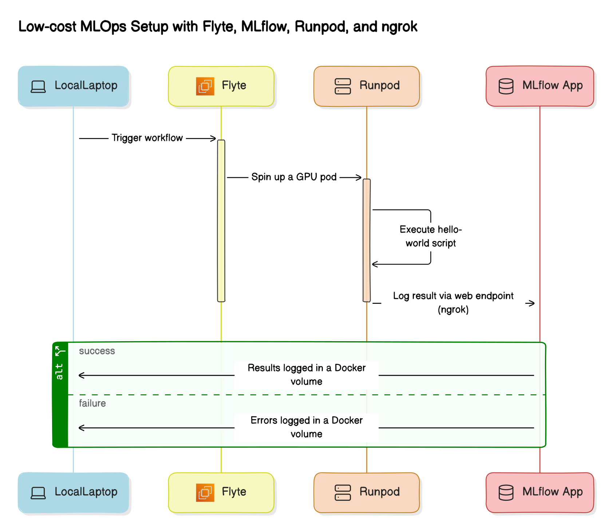

# My Flyte + Runpod + Mlflow + nrgok Demo 

(fig. 1)

This repository contains the code for a Flyte enabled project using Python and [flytekit](https://docs.flyte.org/projects/flytekit/en/latest/).

The code in this repo is intended to be used to execute a flyte workflows on a flyte demo cluster running locally. The flyte workflow then starts a pod with a GPU on runpod's GPU rental service. The pod executes a hello-world script using parameters injected by the flyte workflow, and the results are logged to a locally running mlflow app via a cloud endpoint that has been secured  with ngrok (see figure 1)

The achievement of this demo is a low-cost MLOps platform where the only fees are for the GPUs rented by runpod. This basic platform has the ability to execute flyte workflows, use GPU rental services, and automatically log metadata to flyte and mlflow. 

In follow up work I would like to improve on this MLOps system in order to run real ML workloads on GPU. 

## Structure

The repository is structured as follows:

- `hello-world/`: Contains a simple hello world application with a Dockerfile, Kubernetes configuration, and associated tests.
- `mlflow-ngrok-image/`: Contains the Dockerfile and Kubernetes configuration for the MLFlow tracking server.
- `my_project/`: Contains the Flyte workflows for the project.
- `my-flyte-images/`: Contains the Dockerfile and Kubernetes configuration for the Flyte images.

## Getting Started

To get up and running with your Flyte project, we recommend following the [Flyte getting started guide](https://docs.flyte.org/en/latest/getting_started.html).

To run this code, one needs to set environment variables for the following:
- the Ngrok auth token 
    - needed to access a web endpoint of the mlflow app via ngrok
- the runpod api-key 
    - needed to access runpod's cloud GPU rental service and start a runpod pod

One must also adjust a few hard-coded parameters for the basic auth used to secure the ngrok web endpoint. These parameters are
- USERNAME
- PASSWORD

and they must be configured in the `start.sh` script of the mlflow app and the flyte task contained in `example.py` of the flyte project.  

## Building and Running

Each directory contains a `Dockerfile` for building the associated Docker image, and a `skaffold.yaml` for deploying the application with Skaffold.

## Testing

Tests for the hello world application can be found in `hello-world/test_hello_world.py`.

## License

This project is licensed under the terms of the license found in [my_project/LICENSE](my_project/LICENSE).
